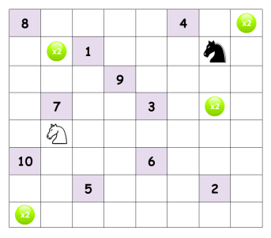
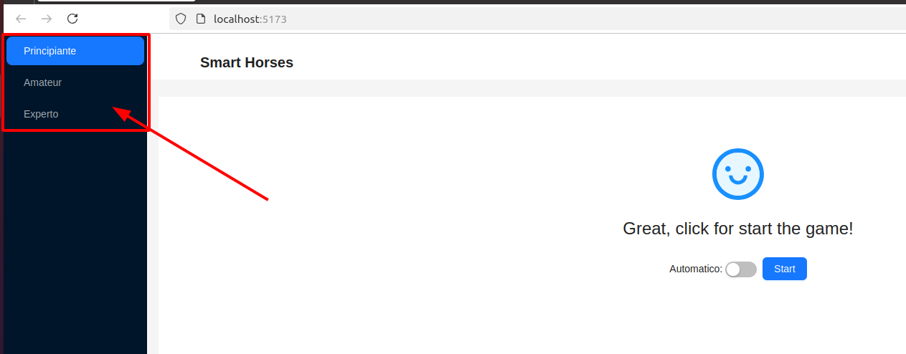
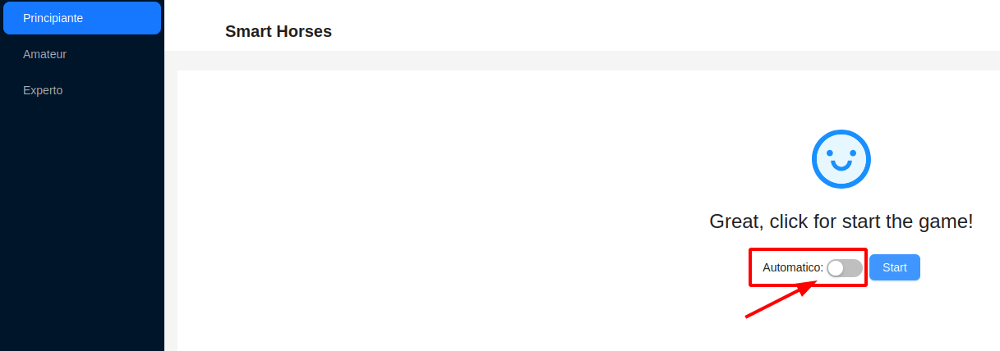
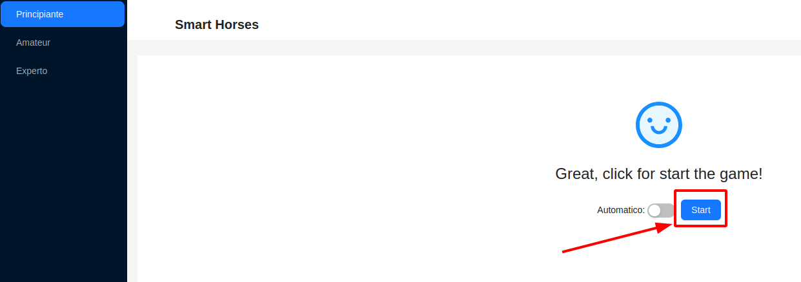
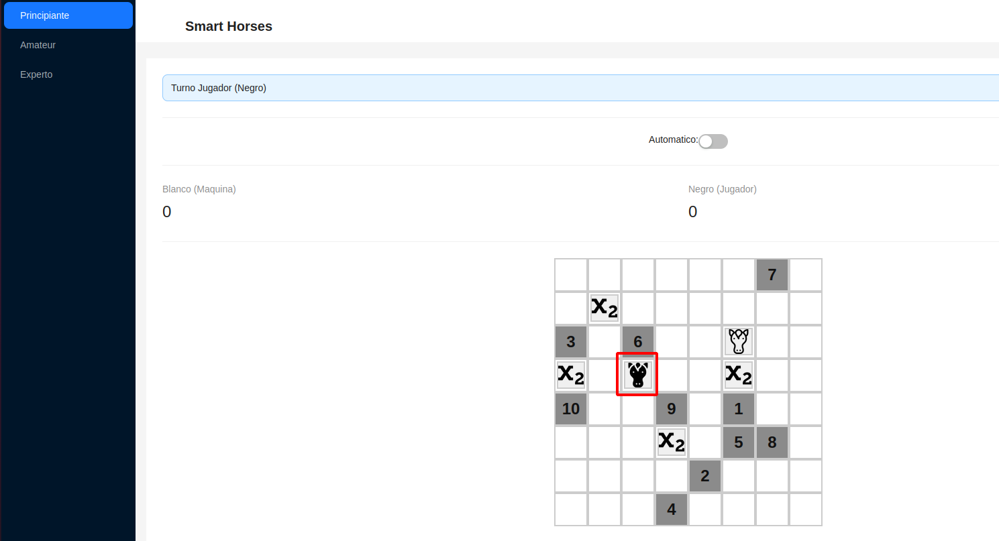

# Smart horses

Es un juego entre dos adversarios en el que cada uno controla un caballo
sobre un tablero de ajedrez. En el tablero hay diez casillas que le permiten obtener de 1 a 10
puntos al primer caballo que las alcance. Además, hay cuatro casillas en las que se puede
encontrar el símbolo x2 que permite multiplicar por dos la cantidad de puntos de una casilla.
Este símbolo aplica para una sola casilla con puntos y es la que alcance el caballo después de
haber tomado dicho símbolo. Los símbolos x2 no son acumulables, es decir, no se puede tomar
un símbolo x2 si el caballo ya tiene otro. El juego termina cuando no queden más casillas con
puntos. A continuación, se muestra un posible estado inicial del juego. Las posiciones iniciales
de los caballos, de las diez casillas con puntos, y de las cuatro casillas donde están los símbolos
x2, son aleatorias.



**Tambien pedes probar el juego en la siguente [pagína](https://smart-horses.fshll.com/).**

## Recommended IDE Setup

[VSCode](https://code.visualstudio.com/) + [Volar](https://marketplace.visualstudio.com/items?itemName=Vue.volar) (and disable Vetur).

## Project Setup

```sh
npm install
```

### Compile and Hot-Reload for Development

```sh
npm run dev
```

### Compile and Minify for Production

```sh
npm run build
```

## Uso

Selecciona un nivel:



Puede activar «Automático» si desea que la máquina juegue en tu lugar.



Inicia la partida:



Juega como el caballo negro:

